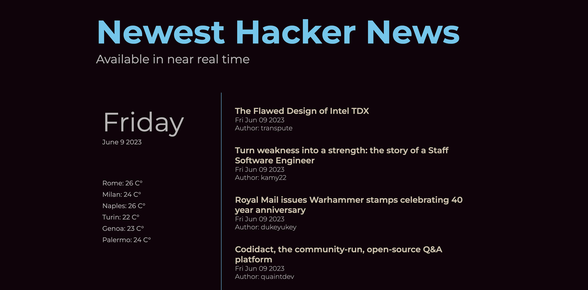

# Counter - Cristina Zlatov



I build the my third project for the [Start2Impact](https://www.start2impact.it/) online course. It is a News API and Weather API based project in Vanilla JavaScript.

## Table of contents

- [Overview](#overview)
  - [The task](#the-challenge)
  - [Links](#links)
- [My process](#my-process)
  - [Built with](#built-with)
  - [What I learned](#what-i-learned)
  - [Useful resources](#useful-resources)
- [Author](#author)
- [Acknowledgments](#acknowledgments)

## Overview

### The task

### Links

- URL: [Live Website URL](https://vocal-rugelach-86d415.netlify.app/)

## My process

### Built with

- Semantic HTML5 markup
- Sass
- Flex-box
- Mobile-first workflow
- JavaScript
- Fetch API

### What I learned or got more details on

```css

```

```javascript

```

### Useful resources

- []()
- []() -

## Author

- Twitter - [Cristina Zlatov](https://twitter.com/zlatov_cristina)
- Linkedin - [Cristina Zlatov](https://www.linkedin.com/in/cristina-zlatov/)

## Acknowledgments

Finally I'd like to thank Start2Impact for inspiring me to take on their course in the first place and making me feel comfortable while learning everything from zero.
